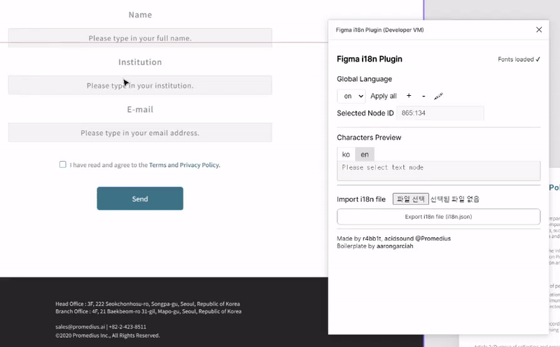
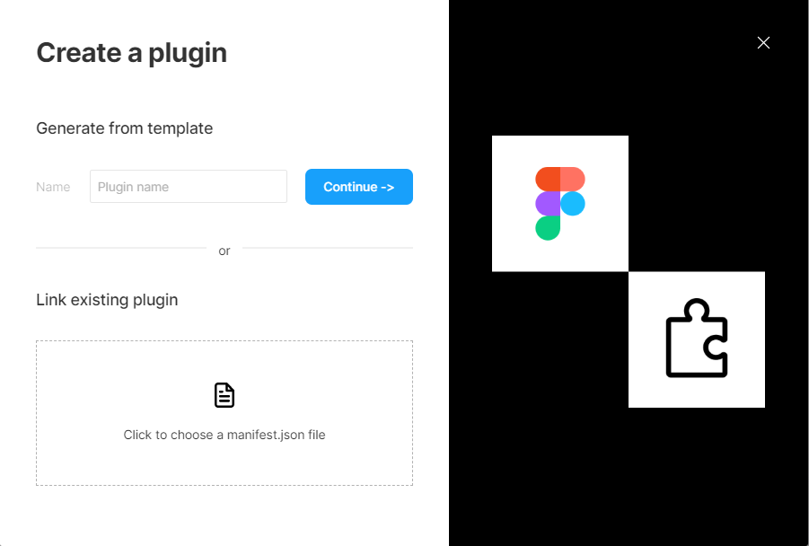

**Figma plugin for i18n**

## 빠른 시작

1. 이 저장소를 clone 한다.

2. npm 의존성을 설치한다.

   ```bash
   npm install
   ```

3. dev script를 시작한다.
   ```bash
   npm run dev
   ```

## Figma 에서 실행

- figma app 실행 (web 버전 X)
- figma menu > Plugins > Development > New plugin...

  

- Link existing plugin 아래 아이콘을 클릭하여 `manifest.json` 파일을 선택한다.

### Available commands

- Global Language 관리:
  - figma page에서 사용할 언어를 추가/삭제/변경한다.
- Apply all:
  - 선택한 언어로 전체 Text를 변경한다.
- Node ID - 선택한 node의 ID를 조회한다.
- 선택한 Node의 언어를 변경할 수 있다.
- JSON 파일로 i18n 파일을 내보내기 할 수 있다.
- 내보내기 한 JSON파일을 import하여 i18n 적용할 수 있다.

#### Development

- `npm run dev` 으로 파일 변경을 감지하도록 할 수 있다. `src` 아래의 있는 파일을 변경하면 코드는 자동으로 컴파일 된다. 그 후에 Figma 앱에서 development plugin을 다시 실행한다. (ts만 변경 시 적용이 되지 않는다면 html을 수정하여 watcher가 작동하게 한다.)

#### Production build

- `npm run build` 로 `dist` 에 production 앱을 생성한다. 중요: 새 버전의 플러그인을 release 하기전에 반드시 build를 할 것. 빌드를 생성하기 전에 문법 오류 및 린팅 오류를 꼭 체크.

## License

MIT

Made with ♥️ by [Promedius](https://promedius.ai)
